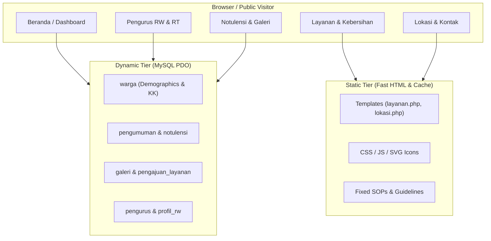

# 📐 Architectural Plan: Static vs Dynamic Data Strategy for Ruang Warga 021

## Goal Description
The objective of this analysis and plan is to establish an optimal strategy for distinguishing **Static Data** (hardcoded or config-driven content) from **Dynamic Data** (database-managed, CRUD-accessible content) in **Ruang Warga 021 (SIRW 021)**. 

By categorizing content correctly, the application achieves:
1. **Higher Performance & Caching Efficiency**: Static assets and constant text load instantly without unnecessary database queries.
2. **Effortless Administration**: Data that changes periodically (e.g., announcements, meeting minutes, citizen records, board members) can be updated by admins via the dashboard without code changes.
3. **Clean Code & Maintainability**: Clear separation between database tables, config files, and view templates.

---

## User Review Required

> [!IMPORTANT]
> **Key Recommendation**: 
> 1. Keep core guidelines, static branding, and physical location maps **100% Static**.
> 2. Move citizen records, user auth, announcements, meeting minutes, gallery, and service requests to **100% Dynamic DB tables**.
> 3. Use a **Hybrid / System Settings** approach for contact details, office hours, and board leadership (Pengurus) so admins can edit them dynamically without developer intervention.

---

## Open Questions

> [!QUESTION]
> 1. **Profil RW & Visi-Misi**: Would you prefer Visi & Misi to remain in static PHP views, or should they be editable via a `profil_rw` table in the Admin Dashboard?
> 2. **Layanan (Aula RW & TPST)**: The rules and terms for borrowing the hall or waste management are currently static. Should we add a dynamic booking/reservation system for citizens in the future?

---

## Categorization & Analysis Matrix

Below is the complete classification for all pages, modules, and content types in Ruang Warga 021:

| Data Element / Entity | Classification | Storage Location | Rationale & Recommendation |
| :--- | :--- | :--- | :--- |
| **Data Warga & Demografi** | **MUST BE DYNAMIC** | MySQL `warga` table | NIK, KK, RT, age, status, and verification states change continuously and require query/filter capabilities. |
| **Pengurus & Roles (Users)** | **MUST BE DYNAMIC** | MySQL `users` table | Admin & board authentication credentials with secure hashing and status flags. |
| **Pengumuman & Urgent Alerts** | **MUST BE DYNAMIC** | MySQL `pengumuman` table | Broadcast messages, urgent notifications, and event announcements created on the fly by admins. |
| **Notulensi Rapat** | **MUST BE DYNAMIC** | MySQL `notulensi` table | Meeting archives, agendas, decision records, and PDF attachments added after every gathering. |
| **Galeri Foto Kegiatan** | **MUST BE DYNAMIC** | MySQL `galeri` table | Photo documentation of community events with upload/delete management. |
| **Pengajuan Layanan** | **MUST BE DYNAMIC** | MySQL `pengajuan_layanan` | Citizen service requests (facility booking, letters, waste management) with status tracking (`pending`, `approved`). |
| **Statistik Real-time** | **DYNAMIC (Aggregated)** | SQL Queries on `warga` | Calculated on demand from the `warga` table to present live RT demographic charts. |
| **Struktur Pengurus RW & RT** | **HYBRID / DYNAMIC** | MySQL `pengurus` table | Board personnel change every 3–5 years. Rendering them from the `pengurus` table enables easy updates. |
| **Profil, Visi, Misi & History** | **HYBRID / CONFIG** | MySQL `profil_rw` or Config | Visi, Misi, and history change very rarely. Storing in DB or Config allows non-technical admins to update text when needed. |
| **Kontak, Jam kerja & Medsos** | **HYBRID / CONFIG** | Global App Settings / DB | Phone numbers, emergency contacts, and social media handles should be centralized in settings rather than hardcoded in footers. |
| **Tata Tertib & Syarat Layanan** | **MUST BE STATIC** | PHP View (`layanan.php`) | SOPs, facility rules, and waste collection guidelines remain consistent. Keeping them static ensures maximum page speed. |
| **Lokasi, Maps & Batas Wilayah** | **MUST BE STATIC** | PHP View (`lokasi.php`) | Physical geography, map embeds, and boundary descriptions do not change. |

---

## Proposed System Architecture



---

## Proposed Changes (For Future Implementation Phase)

### [Component 1] Public View Controllers (`Http/Controllers/HomeController.php`)

#### [MODIFY] `HomeController.php`
- Ensure static settings (contact numbers, office hours) and dynamic models (`Pengurus`, `ProfilRW`) are injected cleanly into views with fallback defaults.

### [Component 2] Views (`views/user/`)

#### [MODIFY] `pengurus-rw.php`
- Render leadership cards dynamically from `$ketuaRw`, `$sekretarisRw`, `$bendaharaRw`, and `$listRt` fetched from database.

#### [MODIFY] `hubungi-kami.php`
- Bind contact details to dynamic settings instead of hardcoded strings.

---

## Verification Plan

### Automated Tests
- Run existing Pest test suite to verify route and authentication stability:
  ```bash
  ./vendor/bin/pest
  ```

### Manual Verification
1. Verify static views (`/lokasi`, `/layanan`, `/tpst`) load cleanly without unnecessary DB overhead.
2. Verify dynamic views (`/pengurus-rw`, `/notulensi`, `/galeri`, `/statistik`) display live, accurate DB entries.
